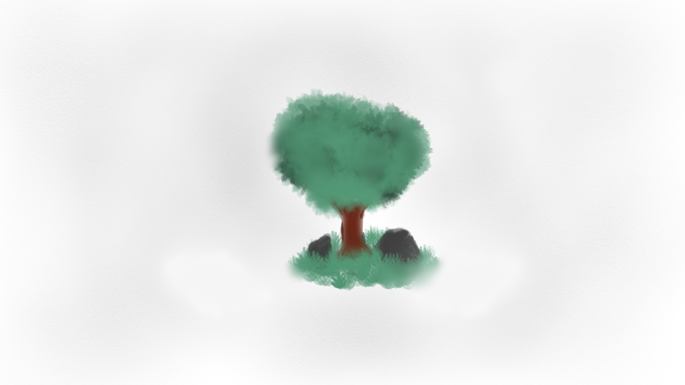

# Portfolio - [chleih.com](https://chleih.com)

## 👋🏽 Introduction

Welcome to the repository of my personal portfolio website. This site showcases my skills, projects, and a bit about myself.

## 🛠 Technologies Used

- **HTML**: Structures the content of the website.
- **CSS**: Styles and layouts the website.
- **JavaScript**: Adds interactivity and enhances the user experience.
- **SASS**: A CSS preprocessor offering features like variables, nested rules, and more.

## 🚀 Getting Started

1. **Tools needed**: You will need `node.js`, `npm`, and `git` installed globally on your machine.
2. **Clone the repository**: `git clone https://github.com/Chleih/Website-Chleih.git`
3. **Navigate to the directory**: `cd portfolio-website`
4. **Compile SASS to CSS** (ensure you have the necessary tools installed): `sass src/sass/main.sass src/dist/css/main.css`
5. **Open `index.html` in a browser** to view the website.

## ✨ Features

- **Interactive UI**: Enhanced with pure JavaScript for a smooth user experience.
- **Responsive Design**: Website optimized for various screen sizes, ensuring a pleasant experience on both desktop and mobile.
- **SASS Architecture**: Modular SASS approach, making styles more maintainable.

## 🤝 Contribution

Feel free to fork this repository, submit pull requests, or suggest any other ways to improve the code.

## 📞 Contact

For questions or discussions about a project, contact me via [my email](mailto:Chleih@outlook.com) or on [LinkedIn](https://www.linkedin.com/in/chleih/).
